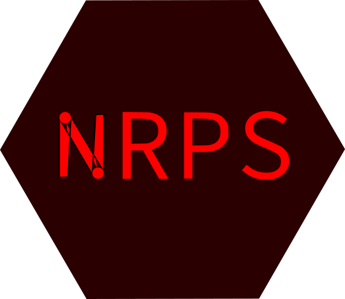
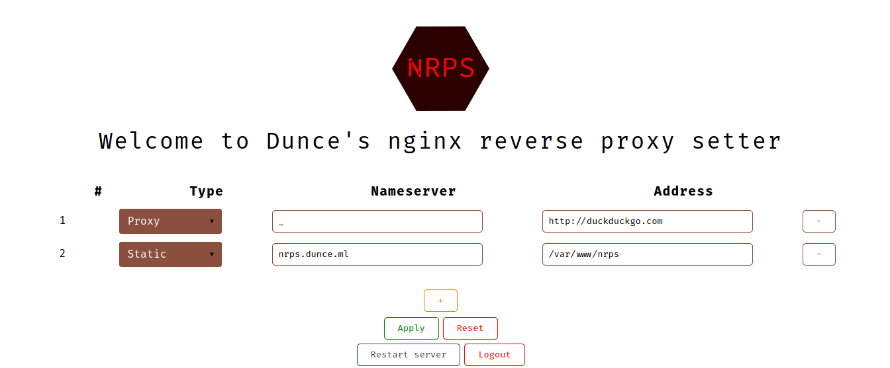
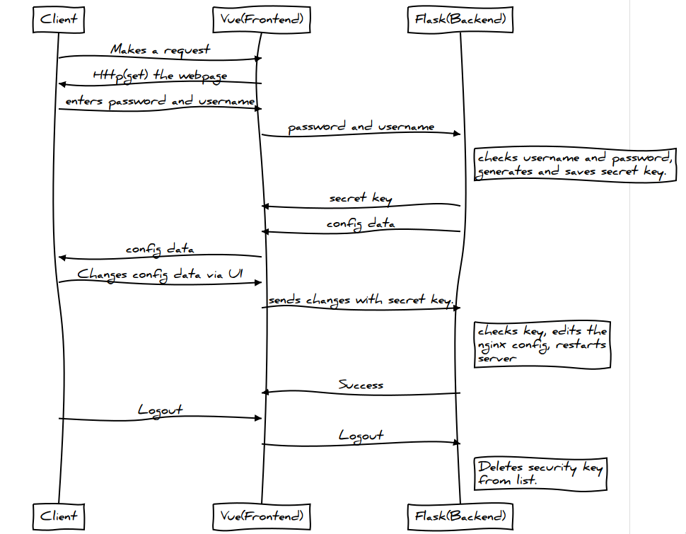

# NRPS

Nginx Reverse Proxy Setter

It started just for reverse proxy but now you can do all static file handling as well

If you wondering if this is secure this uses a 2^7 bit security code to do anything.

It provides with a frontend to setup Nginx server.

Because the nginx confs are ugly🤢

## Screenshot

## Requirements

#### Build machine

Usually your laptop or desktop but can be the remote server itself

- NodeJS

#### Deployment machine

The remote server

- python3 (For reading and righting the nginx config)
- python3-pip (installing things for python)
- virtualenv (so that nrps does not mess up other things)
- nginx (duh …)
- supervisor (to keep python running and restarting when it stops)
- certbot (for https)
- certbot-nginx (for https)

## How to Install and run

Follow [docs](http://deshmukh-blog.netlify.app/detail/6.html)

## Architecture

A flask api(backend) run as a root user, can read and write the nginx conf file, it gets requests form front end.

The fronend is a vue app, requests are send using axios.

Login authentication is done by flask

## How to run (development)

#### Frontend

- set up ip address in `./frontend/src/store/index.ts` in the place of `xxx.xxx.xxx.xxx`
- `cd frontend/`
- `npm install`
- `npm run serve`

#### Backend/API

- Set up IP address in `./backend/api.py` in the place of `xxx.xxx.xxx.xxx`
- Put in the `USERNAME` and `PASSWORD` in `./backend/api.py`
- `cd backend`
- `pip install -r requirements.txt`
- `python api.py`
